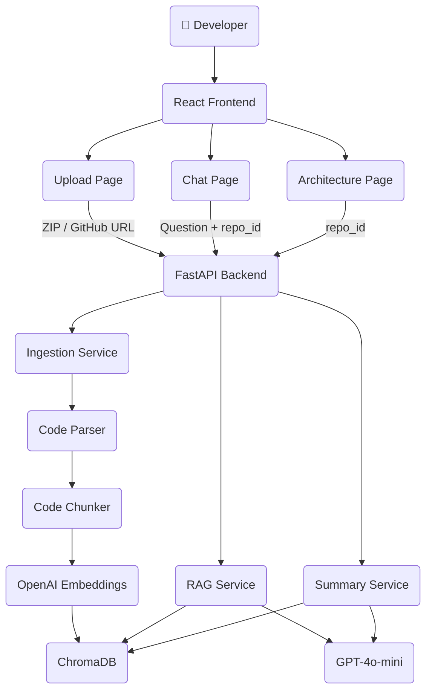

# CodeMind — AI Codebase Assistant

> A production-quality RAG-powered developer tool that lets you upload or connect any repository and ask AI questions about the codebase — architecture, bugs, tests, and more.

```
graph TD
  User --> Frontend(React + Vite)
  Frontend --> FastAPI(FastAPI Backend)
  FastAPI --> Parser(Code Parser & Chunker)
  Parser --> Embeddings(OpenAI Embeddings)
  Embeddings --> ChromaDB(ChromaDB Vector Store)
  FastAPI --> RAG(RAG Service)
  RAG --> ChromaDB
  RAG --> LLM(OpenAI GPT-4o-mini)
  LLM --> Frontend
```

---

## Features

| Feature | Description |
|---|---|
| **GitHub Integration** | Paste any public GitHub URL → auto-clones & indexes |
| **ZIP Upload** | Upload a zipped local repository |
| **AI Chat (4 Modes)** | Explain · Bug Hunt · Generate Tests · Architecture |
| **Semantic Search** | Vector search over code using ChromaDB + OpenAI embeddings |
| **Repo Summary** | Auto-generated overview: language, modules, dependencies |
| **Architecture Diagram** | AI-generated Mermaid diagram of component relationships |
| **Bug Detection** | Finds security issues, missing error handling, logic errors |
| **Test Generation** | Generates pytest (Python) or Jest (JS/TS) unit tests |

---

## Tech Stack

### Backend
| Tool | Purpose |
|---|---|
| **Python 3.11+** | Runtime |
| **FastAPI** | REST API framework |
| **ChromaDB** | Local vector database (persistent) |
| **OpenAI API** | Embeddings (`text-embedding-3-small`) + LLM (`gpt-4o-mini`) |
| **LangChain** | LLM orchestration helpers |
| **GitPython / git CLI** | GitHub repo cloning |

### Frontend
| Tool | Purpose |
|---|---|
| **React 18 + Vite** | UI framework |
| **react-markdown** | Render AI markdown responses |
| **mermaid.js** | Render architecture diagrams |

### Deployment
| Tool | Purpose |
|---|---|
| **Railway** | Backend hosting |
| **Vercel** | Frontend hosting |

### IDE
- **Visual Studio Code** with extensions: Python, Pylance, ESLint, Prettier, GitLens, Mermaid Preview, Thunder Client

---

## Project Structure

```
ai-codebase-assistant/
├── backend/
│   ├── main.py                    # FastAPI entry point
│   ├── requirements.txt
│   ├── railway.toml               # Railway deployment config
│   ├── .env.example
│   ├── api/
│   │   └── routes.py              # All API endpoints
│   ├── core/
│   │   ├── parser.py              # File walker + code chunker
│   │   └── vector_store.py        # ChromaDB + OpenAI embeddings
│   └── services/
│       ├── ingestion_service.py   # ZIP + GitHub pipeline
│       ├── rag_service.py         # RAG loop (4 modes)
│       └── summary_service.py     # Repo summary + Mermaid
│
└── frontend/
    ├── index.html
    ├── package.json
    ├── vite.config.js
    ├── vercel.json
    ├── .env.example
    └── src/
        ├── main.jsx
        ├── App.jsx
        ├── styles/
        │   └── globals.css
        ├── components/
        │   ├── Sidebar.jsx
        │   └── Sidebar.css
        └── pages/
            ├── UploadPage.jsx      # GitHub URL + ZIP upload
            ├── UploadPage.css
            ├── ChatPage.jsx        # AI chat interface
            ├── ChatPage.css
            ├── ArchitecturePage.jsx # Mermaid + repo summary
            └── ArchitecturePage.css
```

---

## Quick Start (Local Development)

### 1. Clone this repo
```bash
git clone https://github.com/your-username/ai-codebase-assistant
cd ai-codebase-assistant
```

### 2. Backend setup
```bash
cd backend

# Create and activate virtual environment
python -m venv venv
source venv/bin/activate        # Windows: venv\Scripts\activate

# Install dependencies
pip install -r requirements.txt

# Configure environment
cp .env.example .env
# Edit .env and add your OPENAI_API_KEY

# Start the server
uvicorn main:app --reload --port 8000
```

Backend runs at: `http://localhost:8000`
API docs at: `http://localhost:8000/docs`

### 3. Frontend setup
```bash
cd frontend

# Install dependencies
npm install

# Configure environment
cp .env.example .env.local
# VITE_API_URL is already set to http://localhost:8000/api for local dev

# Start dev server
npm run dev
```

Frontend runs at: `http://localhost:3000`

---

## API Endpoints

| Method | Endpoint | Description |
|---|---|---|
| `POST` | `/api/upload-repo` | Upload a `.zip` repository archive |
| `POST` | `/api/load-github-repo` | Clone & index a GitHub repo by URL |
| `POST` | `/api/ask-question` | Ask a question (RAG pipeline) |
| `GET`  | `/api/repo-summary/{repo_id}` | Get AI-generated repo summary |
| `GET`  | `/api/repos` | List all indexed repositories |
| `GET`  | `/health` | Health check |

### Example: Load a GitHub repo
```bash
curl -X POST http://localhost:8000/api/load-github-repo \
  -H "Content-Type: application/json" \
  -d '{"github_url": "https://github.com/tiangolo/fastapi"}'
```

### Example: Ask a question
```bash
curl -X POST http://localhost:8000/api/ask-question \
  -H "Content-Type: application/json" \
  -d '{
    "question": "Where is authentication implemented?",
    "repo_id": "YOUR_REPO_ID",
    "mode": "explain"
  }'
```

### Chat modes
| Mode | Description |
|---|---|
| `explain` | Explain code, architecture, and patterns |
| `bugs` | Detect security vulnerabilities and logic errors |
| `tests` | Generate pytest / Jest unit tests |
| `architecture` | High-level architecture analysis + Mermaid diagram |

---

## Example Prompts

```
Where is authentication implemented?
Explain how the API layer works.
Which files interact with the database?
How do services communicate with each other?
Generate unit tests for the user service.
Identify possible bugs in the auth module.
Summarize the overall architecture of this repository.
What design patterns are used in this codebase?
Is there any missing error handling?
Explain the database schema.
```

---

## Deployment

### Deploy Backend to Railway

1. Push backend folder to GitHub
2. Go to [railway.app](https://railway.app) → New Project → Deploy from GitHub
3. Select your repo → set root directory to `backend/`
4. Add environment variable: `OPENAI_API_KEY=sk-...`
5. Railway auto-detects `railway.toml` and deploys

Your backend URL will be: `https://your-app.railway.app`

### Deploy Frontend to Vercel

1. Go to [vercel.com](https://vercel.com) → New Project → Import GitHub repo
2. Set root directory to `frontend/`
3. Add environment variable: `VITE_API_URL=https://your-app.railway.app/api`
4. Deploy

---

## How the RAG Pipeline Works

```
User Question
     │
     ▼
OpenAI text-embedding-3-small
     │
     ▼
ChromaDB cosine similarity search
     │
     ▼
Top-8 most relevant code chunks retrieved
     │
     ▼
Context assembled with file paths + line numbers
     │
     ▼
GPT-4o-mini with mode-specific system prompt
     │
     ▼
Answer streamed to frontend
```

---

## Supported File Types

| Extension | Language |
|---|---|
| `.py` | Python |
| `.js` `.jsx` | JavaScript |
| `.ts` `.tsx` | TypeScript |
| `.go` | Go |
| `.json` | JSON |
| `.md` | Markdown |

Binary files, `node_modules`, `__pycache__`, `.git`, `dist`, `build` are automatically ignored.

---

## Environment Variables

### Backend (`.env`)
```env
OPENAI_API_KEY=sk-...          # Required
LLM_MODEL=gpt-4o-mini          # Optional, default: gpt-4o-mini
CHROMA_PATH=./chroma_db        # Optional, default: ./chroma_db
```

### Frontend (`.env.local`)
```env
VITE_API_URL=http://localhost:8000/api   # Point to your backend
```

---

## Architecture Diagram (This Project)



---

## License

MIT — free to use, modify, and deploy.
